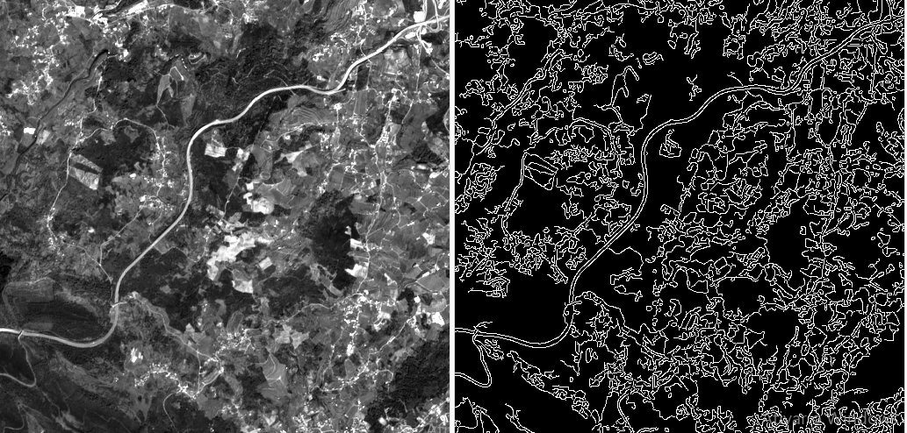
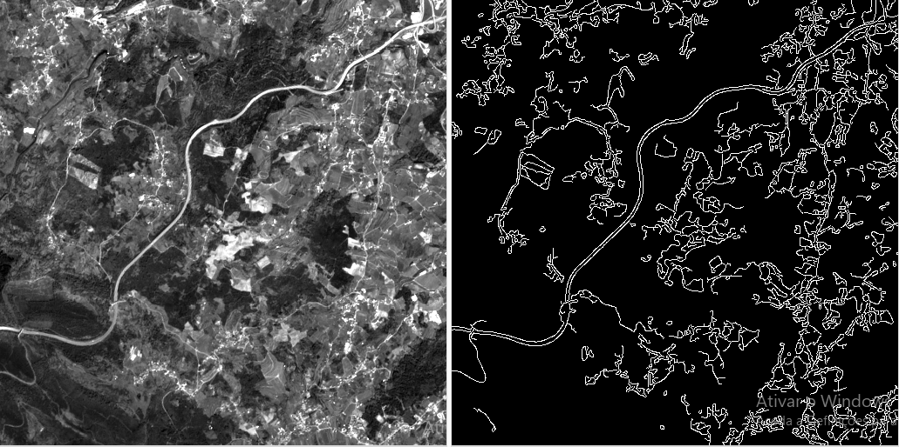
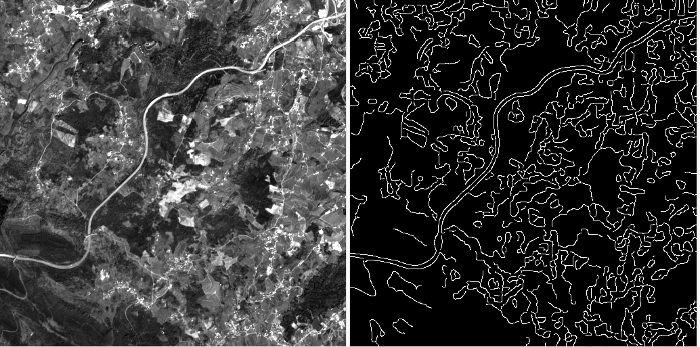
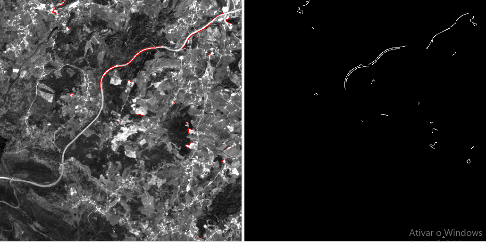

# Tecnologias e Aplicações

## Segmentação de estradas em imagens do Sentinel-2

#### José Cunha - A74702
#### Pedro Fonseca - A74166

### Descrição do problema

Este projeto tem como principal objetivo a obtenção de um mapa de estradas a partir do processamento de um conjunto de imagens provenientes do satélite Sentinel-2, utilizando para isso técnicas de processamento de imagem com a ajuda da ferramenta **OpenCV** no **Python**.

A segmentação de estradas é um problema complexo, que neste caso necessita da utilização de técnicas que envolvem *deep learning* para resolver o problema.

### Implementação

Utilizando a linguagem **Python**, foi implementada uma técnica baseada no algoritmo de *Canny*.
A técnica passa pelo uso da segmentação de *Canny* para detetar estradas, pois este algoritmo é especialmente eficaz na deteção de zonas com elevada frequência. Dado que as intensidades das estradas são diferentes do meio que as rodeia, esta variação deve ser detetada pelo algoritmo de *Canny*.

De forma a simplificar a avaliação dos resultados optamos por dividir em secções a imagem original tirada pelo satélite e como tal, iremos processar cada uma delas igualmente no entanto só analisaremos uma dessas secções.

De forma a determinar que imagens usar, utilizamos o **QGIS** para fazer a análise das mesmas. Optamos por utilizar então a imagem **TCI**.

A aplicação, denominada *canny.py*, lê da pasta *R10m* a imagem adequada e determina depois mediante os argumentos passados que técnica utilizar.

#### Funções e APIs usadas

Para poder aplicar os algoritmos necessários, tivemos de recorrer à API *gdal*, que é usada para ler os ficheiros *.jp2*. Para além dessa,usamos **APIs** comuns como *numpy*, *cv2* e *matplotlib*.

As função principal do programa é a *segment_roads*, que divide a imagem em partes mais pequenas e itera por cada uma aplicando o algoritmo de segmentação.

A função *process_canny* e *process_morphology* processam a imagem recebida de forma a produzir uma imagem com a segmentação efetuada, mas usando métodos distintos (será detalhado à frente).

#### Algoritmo de Canny

O problema que surge quando se aplica o algoritmo de *Canny* resulta da possível deteção de bordas noutras partes da imagem que também tenham variações bruscas de intensidades (altas frequências). Devido à sensibilidade do algoritmo a zonas de alta frequência, zonas com casas com cores muito diferentes ou com nuvens são passíveis de serem detetadas como sendo estradas, o que resulta numa imagem que não representa só as estradas. Para tentar combater esse problema, tentamos aplicar uma série de técnicas para tentar diminuir as deteções do algoritmo.

Tentamos fazer uma equalização do histograma para melhor ditribuir as diferentes intensidades. No entanto, a utilização desta técnica piorou os resultados, resultando numa imagem com demasiadas deteções.

  

Começamos por fazer uma *gamma correction* para tentar melhorar o contraste da imagem, para que as estradas pudessem ter um maior contraste enquanto o resto teria um contraste diminuído. Esta operação resulta numa imagem um pouco melhor do que aplicando o *Canny* na imagem original, mas mesmo assim ainda sofre do problema da deteção de vários objetos diferentes que não correspondem a estradas.

Utilizamos ainda uma técnica de deteção de pontos claros na imagem. Essa função, quando aplicada, remove as partes mais claras da imagem.Como as estradas não têm intensidades próximas das apresentadas nas nuvens, em princípio não ocorrerá em nenhum caso a eliminação de estradas da imagem.

Depois de fazer a *gamma correction*, a imagem ficou da seguinte forma:

  

Como se pode ver, o problema nas deteções, em grande parte, continua a ser as casas que têm muito contraste com o meio envolvente. Teriam de ser usados métodos mais sofisticados de processamento de imagem para conseguir obter melhores resultados.

Numa tentativa final de melhorar os resultados diminuindo as frequências gerais da imagem, foi passado um filtro passa-baixo (gaussiano) com o *kernel* de 5 por 5. Como esse filtro diminui a variação brusca das intensidades em píxeis adjacentes, o resultado consiste numa menor frequência geral e, assim, na menor deteção de bordas pelo algoritmo.

As imagens seguintes correspondem às imagens anteriores com a única alteração sendo a passagem do resultado, antes do algoritmo de *Canny* ser aplicado, de um filtro passa-baixo:

  

  

A última imagem sofreu uma perda considerável das estradas porque o filtro passa-baixo fez um *blur* demasiado elevado na imagem original,resultando numa borda demasiado suave para ser detetada.

#### Algoritmo com operações morfológicas

Embora não tenha sido mostrado neste *readme*, uma vez que os resultados não tinham grande qualidade, foi também implementado um outro método denominado *process_morphology* que tenta fazer a segmentação recorrendo a operações morfológicas e não com o algoritmo de *Canny*. Para que tal possa ser executado, basta modificar a função *segment_roads* para invocar, no ciclo, a função *process_morphology* em vez da função *process_canny*.

### Conclusão e discussão de resultados

Embora as operações usadas sejam capazes de detetar estradas, por vezes detetam demasiados objetos indesejáveis. Consegue-se concluir que o algoritmo funciona melhor nos casos em que há menos casas e outros tipos de edifícios, ou seja quando estamos perante ambientes mais rurais, como se pode ver nos exemplos mostrados.

Podemos concluir que os melhores resultados foram obtidos através da aplicação da *gamma correction* e da deteção de pontos de elevada intensidade, sendo que em certos casos os resultados são melhorados aplicando um filtro passa-baixo antes de aplicar o algoritmo de *Canny*.

Dado o reduzido tempo de prática com este tipo de técnicas e programas, reconhecemos que de facto existem múltiplos problemas com a nossa implementação assim como a comparação de resultados, no entanto consideramos que tendo em conta todos os fatores conseguimos de facto implementar uma solução capaz de fazer em parte o que foi pedido no enunciado.
